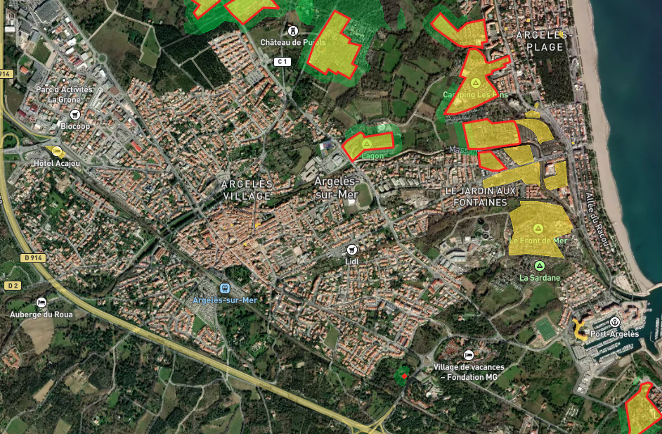

# WUITIPS - Touristic Hot Spot Mapping
touristic hot spot mapping for wuitips project

## 1. raw data

### the Open Street Map (osm) data 
uploaded from the [geofabrik sever](https://download.geofabrik.de/)
1. cataluna-latest.osm.pbf  (Dec 2023) 
1. languedoc-roussillon-latest.osm.pbf (Nov 2023)

### the Corine Land Cover (lcl) data 
upload fromt the [Copernicus server](https://land.copernicus.eu/en/products/corine-land-cover/clc2018)
we use here the vector format of the 2018 version `u2018_clc2018_v2020_20u1_geoPackage`

## 2. pre-processing

### touristic infrastructure map
see `src-load/tourismSpot.py`

it combines polygon from the osm with the flag tourism and building footprint that contains a point tagged with the tourism flag

### fuel category
see `src-load/load-clc-category.py'

it defined 6 fuel category out of the lcl data set. 3 are forest and 3 are grass or agricultural area.

### (optional) Aggregation Index (AI) computation
see `src-map/compute_ai.py`

it computes the agggegation index of the vegeation patch to convert fuel category in Hazard Category following the approach used in [Planas et al 2023](https://doi.org/10.1016/j.firesaf.2023.103906).
An option can be set to use AI or not in the computation of the WUI.

## 3. WUI processing
see `src-map/tourismWUI.py`

it computes de WUI associated to each touristic polygon of the touristic infrastructure map.
an input parameter `flag_ai` activate of not the use of AI (ie conversion of fuel to hazard categories)
The distance of interaction of each fuel/hazard is defined in the variables `bufferDistVegCat` for each of the fuel category defined in `src-load/load-clc-category.py'.
In the current version, forest type vegetation areas have a buffer distance of 200m and agricultural/grass areas have a buffer of 50m. 

## 4. Touristic Hot Spot
see `src-map/tourismHotSpot.py`

A touristic hot spot is defined as a polygon of the touristic infrastructure map with a WUI area greater than 10m2.

## 5. Display

The full domain made of catalunya and Languedoc-Roussillon is available on MapBox by cliking on the image above. 
green is the wui generate by the touristic spot (yellow). When edge is red, the touristic spot is set as an hotspot as defined in section 3. 
